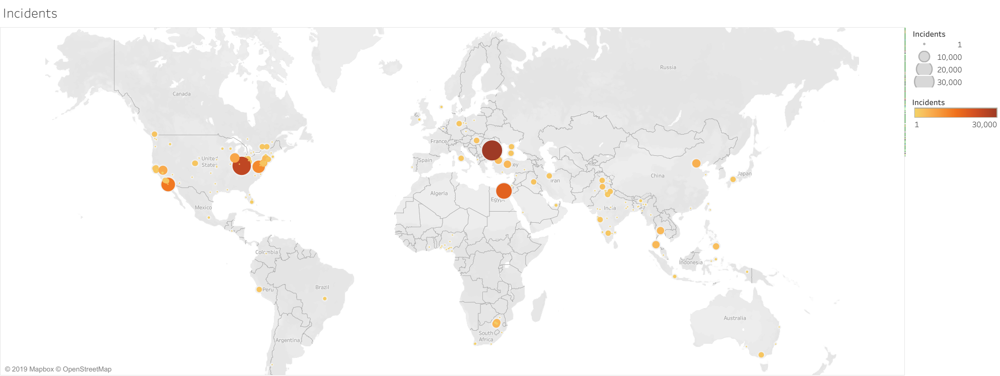
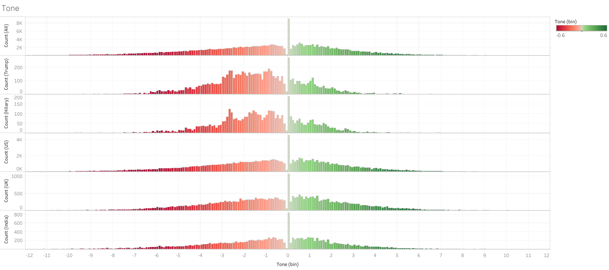
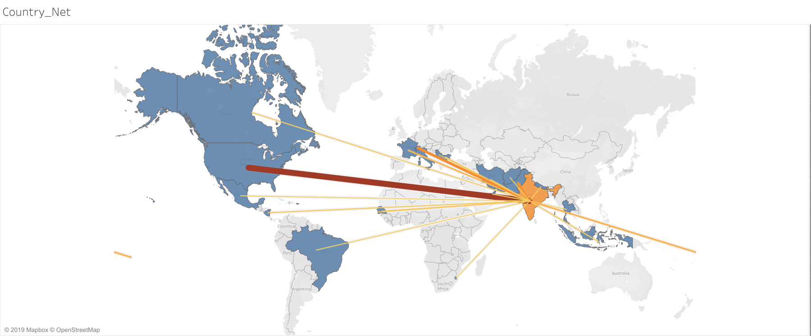
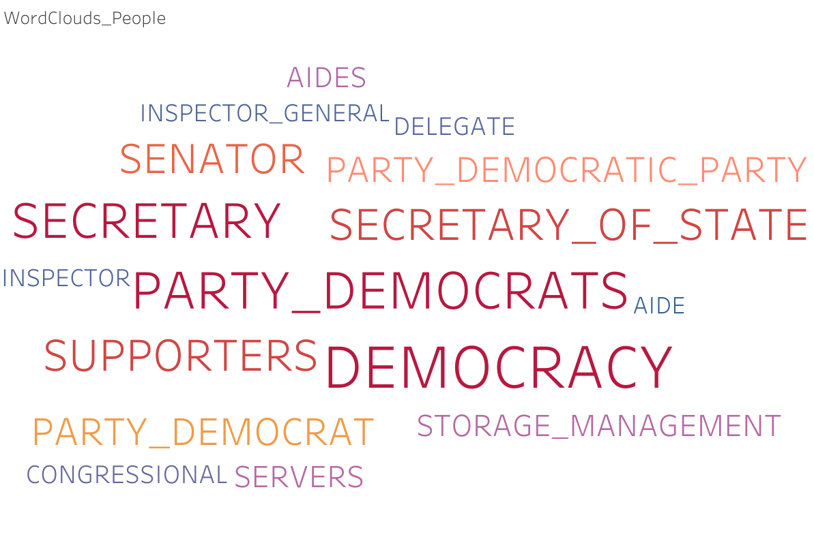
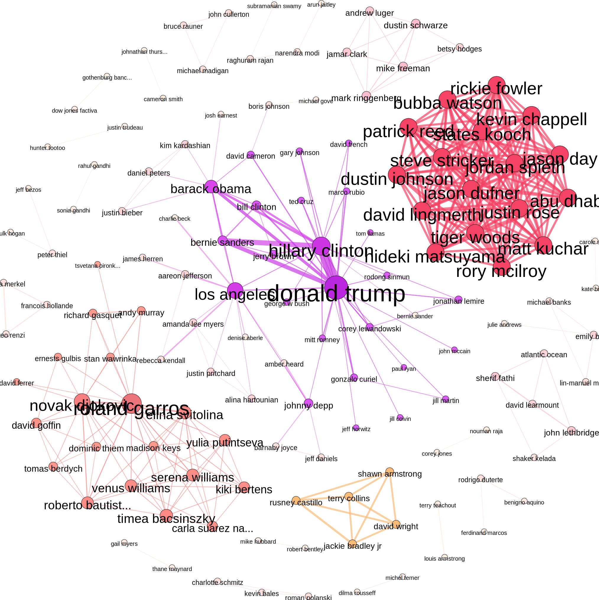

# Big Data Analytics using Hadoop on GDELT Global News Dataset 
This repository performs Big Data Analytics using Hadoop on [Global Database of Events, Language and Tone](https://www.gdeltproject.org/) (GDELT) News Datset. This data is free source and consists of daily datasets in CSV format.

<table class="tg">
  <tr>
    <th class="tg-c3ow" colspan="2">Tab Delimited Columns of GEDLT GKG Database</th>
  </tr>
  <tr>
    <td class="tg-c3ow">DATE</td>
    <td class="tg-c3ow">In YYYYMMDD format (eg: 20160601)</td>
  </tr>
  <tr>
    <td class="tg-c3ow">NUMARTS</td>
    <td class="tg-c3ow">Number of articles related to events</td>
  </tr>
  <tr>
    <td class="tg-c3ow">COUNTS</td>
    <td class="tg-c3ow">List of all counts associated with the event, for multiple possible count types (eg: AFFECT, ARREST, KIDNAP, KILL, etc.)</td>
  </tr>
  <tr>
    <td class="tg-c3ow">THEMES</td>
    <td class="tg-c3ow">List of all themes found in the article</td>
  </tr>
  <tr>
    <td class="tg-c3ow">LOCATIONS</td>
    <td class="tg-c3ow">List of locations associated with event</td>
  </tr>
  <tr>
    <td class="tg-c3ow">PERSONS</td>
    <td class="tg-c3ow">List of persons associated with event</td>
  </tr>
  <tr>
    <td class="tg-c3ow">ORGANIZATIONS</td>
    <td class="tg-c3ow">List of organizations associated with event</td>
  </tr>
  <tr>
    <td class="tg-c3ow">TONE</td>
    <td class="tg-c3ow">List of numbers used to describe the tonality of the article</td>
  </tr>
  <tr>
    <td class="tg-c3ow">CAMEOEVENTIDS</td>
    <td class="tg-c3ow">List of integers to describe the event using the Conflict and Mediation Event Observations (CAMEO) IDs</td>
  </tr>
  <tr>
    <td class="tg-c3ow">SOURCES</td>
    <td class="tg-c3ow">List of sources</td>
  </tr>
  <tr>
    <td class="tg-c3ow">SOURCEURLS</td>
    <td class="tg-c3ow">For web articles, complete URL</td>
  </tr>
</table>

## Results
On the GDELT GKG file corresponding to **1st June 2016**, the following outputs were generated using the specified code. It was near to the **2016 US Presidential Elections** at the time. The visualisations were made with [Tableau](https://www.tableau.com/free )'s public edition. The open-source graph visualisation software [Gephi](https://gephi.org/) was used to generate the network graph of people.

#### Worldwide Disruptive Incidents
The visualization below shows the number of incidents which were violent in nature occurring all across the world on 2016-06-01.

#### Public Perception using Tone
The graphs below depict the tone distribution of several articles published on 2016-06-01. This contains the general distribution of all events, as well as the distribution of Donald Trump, Hillary Clinton, and the countries of the United States, United Kingdom, and India.

#### Network of Countries
The map below depicts the countries that are frequently referenced together. Because this graph contains a lot of data, you may choose a nation and the graph will show the links between that country and other countries. The width and colour of those countries are determined by how frequently they are referenced in the same sentence. The more times they've been referenced together, the thicker and darker the line becomes.

#### Most mentioned cities and countries
The map below depicts the most frequently referenced cities and nations.

#### Experts in their Fields
The visualisation below allows you to choose from a list of persons and then makes a word cloud of the themes / topics that are linked with him / her based on your decision. The person selected by default is 'Hillary Clinton,' with the caveat that these themes are only for publications published on 2016-06-01.

#### Network of People
The network of people is visualised here, with the edges weighted according to how many times they are referenced together in the same article.

